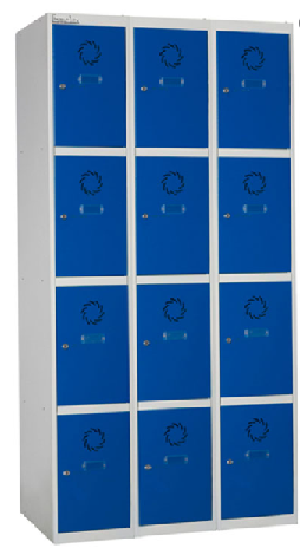

# App Taquillas
La aplicación taquillas sirve para gestionar un taquillero que guarde material con acceso restringido.

Esta aplicación ha sido creada para su uso en una fábrica en la que se quería permitir el acceso a ciertos EPI's solo a parte de la plantilla.

La aplicación permite crear usuarios asociados a un número de tarjeta nfc que tendrán acceso solo a las taquillas autorizadas.

[Demo](https://alejandroferrin.github.io/taquillas/) 

## Material necesario
La aplicación está pensada para activar los GPIO de una __Raspberry Pi 4__ o una __Raspberry Pi Pico__

Si no se puede correr sobre una __Raspberry Pi 4__ porque la política de la empresa en la que se instala el taquillero obliga a usar un Sistema Operativo Windows se puede ejecutar el __JAR__ en una máquina con Windows y con una __Raspberry Pi Pico__ conectada mediante usb al servidor accionar los relés.

__Material__

- Raspberry Pi 4 o Raspberry Pi pico + pc (windows o linux)
- Lector tarjetas NFC ACS - [ACR122U](https://www.acs.com.hk/en/products/3/acr122u-usb-nfc-reader/) 
- Cerraduras electricas 12v

- Leds 12v

- Fuente alimentación 12v

- Relés 5v

- Taquillas

- Pantalla táctil

- Cableado, Carcasa...

----
## Esquema

El sistema permite cablear hasta 20 taquilas, de la salida 0 a la 19. 

(Ejemplo para 2 taquillas)

----
## Instalación

### Raspberry Pi

Instala en una tarjeta mirco SD __Raspberry Pi OS__ usando [Raspberry Pi Imager](https://www.raspberrypi.org/software/) 

Asigna una IP fija a la Raspberry [tutorial](https://raspberryparanovatos.com/tutoriales/asignar-ip-fija-raspberry-pi/) 

Comando instalación:

`curl -s https://raw.githubusercontent.com/alejandroferrin/taquillas/main/setup_taquillas.sh | sudo bash`

__Tareas que realiza el script__

- Crear carpeta AppTaquillas
- Actualizar sistema
- Instalar JDK 1.8
- Instalar librerías funcionamiento smart card reader
- Instalar drivers ACS
- Instalar pi4j
- Instalar docker
- Dar permisos al usuario en grupo docker
- Instalar docker-compose
- Crear el archivo docker-compose.yml

Tras la ejecución del script debes apagar y volver a encender la Raspberry y después ejecutar los siguientes comandos __dentro de la carpeta AppTaquillas:__

`sudo pi4j --wiringpi`

`docker-compose up -d`

`curl -s https://raw.githubusercontent.com/alejandroferrin/taquillas/main/setup_taquillas_final.sh | sudo bash`

Esto levantará los contenedores docker con la base de datos y el administrador de bases de datos al cual podrás acceder a través del navegador en el puerto _8080_

También se crea el servicio que inicia la aplicación al reiniciar.

Debes volver a reiniciar el equipo para que la aplicación detecte la base de datos al ejecutarse.

Para cambiar los argumentos de la ejecución del servicio puedes modificar  el archivo __/etc/rc.local__

En concreto la linea:

`java -jar /home/pi/AppTaquillas/mvc_taquillas-0.0.1-SNAPSHOT.jar --gpio=pi4`

Por ejemplo para la ejecución con cambio de contraseña deberías añadir:

`--admin_password=tu_pass`

### Windows

Actualmente no existe un script que automatice la instalación en windows no obstante los pasos a seguir son los siguientes:

- Instalar JDK 1.8
- (En Windows 10 no es necesario instalar drivers para el lector de tarjetas)
- Instalar mariadb y [crear una base de datos](https://www.daniloaz.com/es/como-crear-un-usuario-en-mysql-mariadb-y-concederle-permisos-para-una-base-de-datos-desde-la-linea-de-comandos/)  llamada mvc_taquillas con un usuario llamado _taquillas_ y password _7aqui11as_
- Descargar [ejecutable](https://github.com/alejandroferrin/taquillas/raw/main/target/mvc_taquillas-0.0.1-SNAPSHOT.jar) 
- Crear servicio que levante al arranque la app:

Deberá ejecutar algo como:
`java -jar <ruta_al_ejecutable> --admin_password=mi_password`

- Cargar el archivo [main.py](pico/main.py) en la __Raspberry Pi Pico__ con el IDE [Thonny](https://thonny.org/) (Se debe configurar la __Pico__ para [usar micropython](https://www.raspberrypi.org/documentation/rp2040/getting-started/#getting-started-with-micropython) )

----
## Uso

[Demo](https://alejandroferrin.github.io/taquillas/) 

La aplicación se ejecuta en el __puerto 9000__ por lo que para acceder se debe escribir en la barra de direcciones de un navegador `http://ip_maquina_servidor:9000`

La pantalla principal se ha creado con la intención de que se visualice en una pantalla táctil próxima al taquillero.

En esta pantalla el usuario debe presionar el botón con el icono de la tarjeta y a continuación se le pedirá que acerque la tarjeta para ser leída. Una vez identificado el usuario podrá seleccionar el artículo deseado y la cantidad a retirar. Si el usuario cuenta con los permisos para la taquilla que contiene los artículos esta se abrirá y podrán ser retirados.

#### Zona del administrador del taquillero
Presionando el botón de Admin accedemos a la zona de administración, en la que se pueden crear usuarios, items, taquillas y consultar las retiradas de material.

El usuario para acceder a esta zona es _admin_ y el password por defecto _7aqui11as_.

El password puede cambiarse si al ejecutar el programa lo hacemos con el argumento `--admin_password=nuevo_password`

- Ejemplo:

`java -jar mvc_taquillas-0.0.1-SNAPSHOT.jar --admin_password=1234`

### Argumentos

- `--linuxport=xxx`
- `--winPort=yyy`
- `--admin_password=my_password`
- `--gpio=pico` o `--gpio=pi4`

