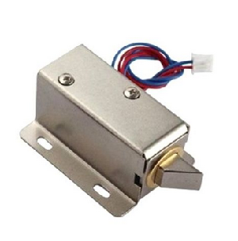
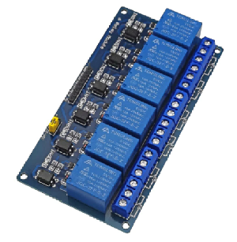

# App Taquillas
La aplicación taquillas sirve para gestionar un taquillero que guarde material con acceso restringido.

Esta aplicación ha sido creada para su uso en una fabrica en la que se quería permitir el acceso a ciertos EPI's solo a parte de la plantilla.

La aplicación permite crear usuarios asociados a un número de tarjeta nfc que tendrán acceso solo a las taquillas autorizadas.

## Material necesario
La aplicación está pensada para activar los GPIO de una __Raspberry Pi 4__ o una __Raspberry Pi Pico__

Si no se puede correr sobre una __Raspberry Pi 4__ porque la política de la empresa en la que se instala el taquillero obliga a usar un Sistema Operativo Windows se puede ejecutar el __JAR__ en una máquina con Windows y con una __Raspberry Pi Pico__ conectada mediante usb al servidor accionar los relés.

Para indicar esta última opción debemos usar el argumento `--os=other`

- Ejemplo:

`java -jar mvc_taquillas-0.0.1-SNAPSHOT.jar --os=other`

__Material__

- Raspberry Pi 4 o Raspberry Pi pico + pc (windows o linux)
- Lector tarjetas NFC ACS - [ACR122U](https://www.acs.com.hk/en/products/3/acr122u-usb-nfc-reader/) 
- Cerraduras electricas 12v

- Leds 12v

- Fuente alimentación 12v

- Relés 5v

- Taquillas

- Pantalla táctil

- Cableado, Carcasa...

----
## Esquema

El sistema permite cablear hasta 20 taquilas, de la salida 0 a la 19. 

(Ejemplo para 2 taquillas)

----
## Instalación

### Raspberry Pi

__TODO__

----
## Uso

La aplicación se ejecuta en el __puerto 9000__ por lo que para acceder se debe escribir en la barra de direcciones de un navegador `http://ip_maquina_servidor:9000`

La pantalla principal se ha creado con la intención de que se visualice en una pantalla táctil próxima al taquillero.

En esta pantalla el usuario debe presionar el botón con el icono de la tarjeta y a continuación se le pedirá que acerque la tarjeta para ser leída. Una vez identificado el usuario podrá seleccionar el artículo deseado y la cantidad a retirar. Si el usuario cuenta con los permisos para la taquilla que contiene los artículos esta se abrirá y podrán ser retirados.

-

-

-

#### Zona del administrador del taquillero
Presionando el botón de Admin accedemos a la zona de administración, en la que se pueden crear usuarios, items, taquillas y consultar las retiradas de material.

El usuario para acceder a esta zona es _admin_ y el password por defecto _7aqui11as_.

El password puede cambiarse si al ejecutar el programa lo hacemos con el argumento `--admin_password=nuevo_password`

- Ejemplo:

`java -jar mvc_taquillas-0.0.1-SNAPSHOT.jar --admin_password=1234`

-

-

-

----
## Licencia
Esta aplicación es de código abierto.
Consulta [LICENSE](LICENSE.md) para conocer las condiciones de la licencia ( GNU GPLv3 )
